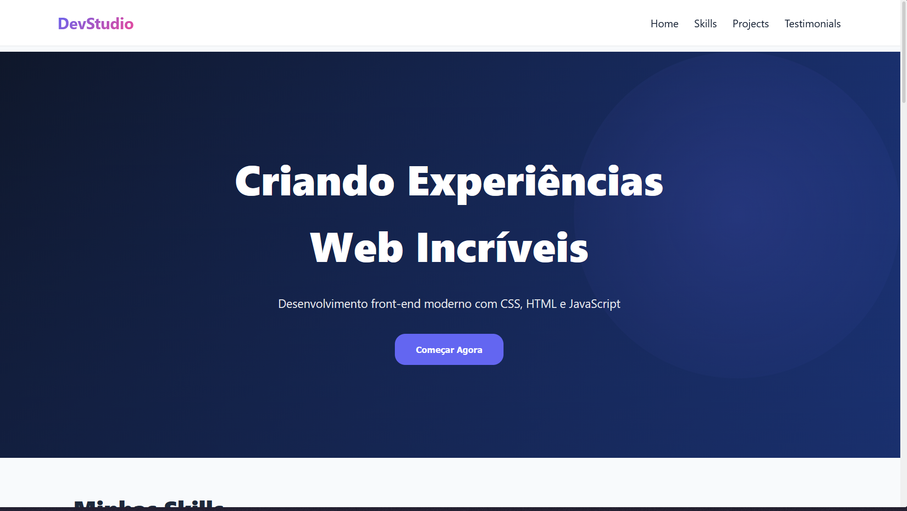

<!-- markdownlint-disable MD033 -->
<!-- markdownlint-disable MD041 -->

# Portfólio / Landing Page (DevStudio)

<p align="center">
  
</p>

## INTRODUÇÃO

- Layout moderno com hierarquia visual clara
- Estrutura profissional com múltiplas seções

## POSITIONS (Todos os 5 tipos em ação)

- **`position: fixed`** — Header que fica no topo ao scrollar
- **`position: relative`** — Hero section e skill cards como base para children
- **`position: absolute`** — Decorações (orbs flutuantes, setas, aspas), sobreposições
- **`position: sticky`** — (títulos de seção)
- **Scroll-to-top button** — Outro exemplo de `fixed`

## VARIÁVEIS CSS (Completas e Profissionais)

```css
:root {
  --primary: #6366f1;
  --space-md: 16px;
  --shadow-lg: 0 10px 25px rgba(0, 0, 0, 0.15);
  /* etc... */
}
```

- Cores, espaçamento, sombras, tipografia — tudo configurável em um lugar
- **Benefício**: Mudar tema inteiro alterando apenas 10 linhas!

## PSEUDO-CLASSES E PSEUDO-ELEMENTOS

**Pseudo-classes (Estados):**

- `:hover` — Efeitos ao passar o mouse
- `:active` — Link ativo na navegação
- `:focus-within` — Cards com foco

**Pseudo-elementos (Conteúdo gerado):**

- `::before` — Decorações (barra de cores, aspas, fundo flutuante)
- `::after` — Linhas decorativas, efeitos de seta em hover
