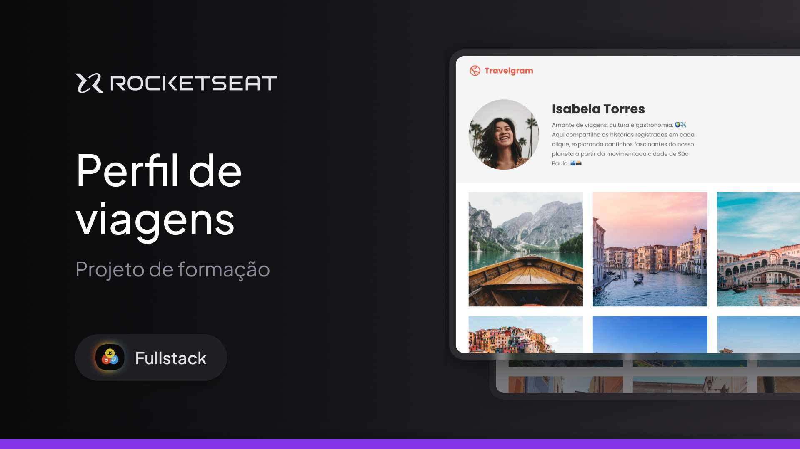

<!-- markdownlint-disable MD033 -->
<!-- markdownlint-disable MD041 -->

<p align="center">
  
</p>

# Travelgran

Projeto desenvolvido com HTML e CSS para compartilhar viagens, cultura e gastronomia. Este projeto foca na criação de um layout atrativo e intuitivo, utilizando práticas modernas de desenvolvimento front-end.

<br>

<p align="center">
  
</p>

## Layout

- [Layout (Figma)](https://www.figma.com/community/file/1360315496868719817)

## Funcionalidades

- Exibição de perfil com informações de viagem, como a cidade e os países visitados.
- Exibição de imagens de viagens registradas, com descrições e ícones personalizados.
- Navegação simples com menu superior, ícones e links.

## Tecnologias Utilizadas

- **HTML5**: Estruturação do conteúdo da página.
- **CSS3**: Estilização visual do layout e componentes.
- **Google Fonts**: Fonte personalizada "Poppins".
- **Imagens e Ícones**: Utilização de imagens representativas das viagens e ícones no layout.

## Estrutura do Projeto

O projeto é estruturado da seguinte forma:

```plaintext
- index.html           # Arquivo principal com estrutura HTML
- styles/index.css     # Arquivo de estilos CSS
- assets/              # Imagens e ícones usados no projeto
```

## Objetivos de Aprendizado

- Aplicação de conceitos de **estruturação semântica em HTML5**.
- Uso de **CSS para layout e estilização visual**.
- Exploração de **fontes externas** com Google Fonts.
- Criação de **menus e navegação** intuitiva.
