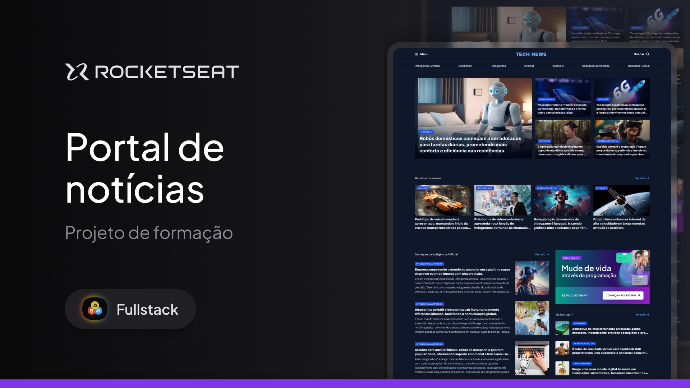

<!-- markdownlint-disable MD033 -->
<!-- markdownlint-disable MD041 -->

  

# Portal de Notícias

 

  

## Descrição

Portal de notícias moderno e responsivo desenvolvido durante os cursos da Rocketseat.

## Tecnologias Utilizadas

- HTML5
- CSS3

## Funcionalidades

- Exibição de notícias em destaque
